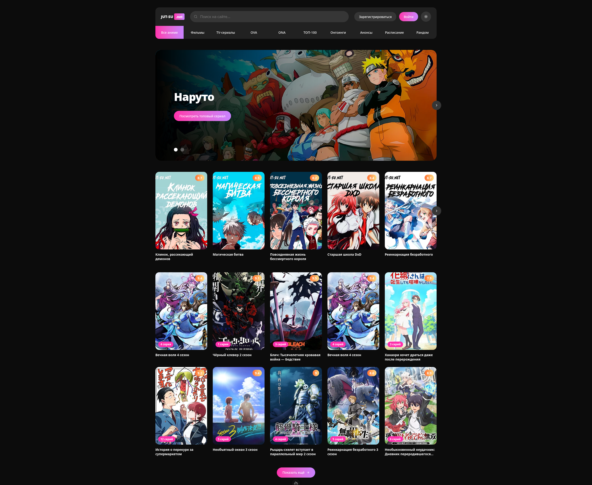

  <picture>
    <source
      media="(prefers-color-scheme: dark)"
      srcset="documentation/images/logo-dark.svg"
    >
    <source
      media="(prefers-color-scheme: light)"
      srcset="documentation/images/logo-light.svg"
    >
    
  </picture>

## Overview

Responsive frontend clone of the Jut.su homepage built with Nuxt 4, Vue 3, TypeScript and Tailwind CSS. Focuses on reusable UI components, responsive layouts and clean project architecture.

## Live Demo

-> https://jutsu-clone.vercel.app/

## Screenshots

  

## Features

### Sections

- Header Section
- Hero Section
- Popular Section
- Catalog Section
- Updates Section
- Top Anime Section
- Comments Section
- About Section
- Footer Section

### Components

- App Button
- App Section
- App Section Header
- Slider Controls
- Slider Pagination
- Anime Card

### Architecture

- Component Architecture
- Data Separation
- Type-safe Interfaces
- Responsive Layout

## Disclaimer

This is an unofficial, non-commercial educational project.
It is not affiliated with, endorsed by, or associated with the original Jut.su website. All trademarks and copyrighted materials belong to their respective owners.

## License

This project is licensed under the MIT License - see the [LICENSE](LICENSE) file for details.
